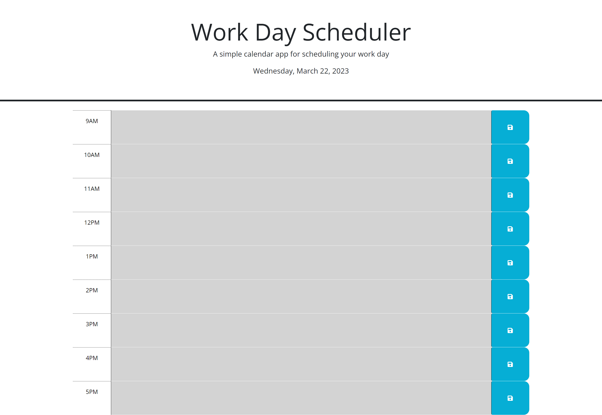

A Work day scheduler (daily planner): showing different colours for past(grey), present(red) and future(green) in relation to what the time is.

the daily planner when you first open the deployed site

the daily planner when you input text into the text area

the daily planner when you refresh the page after user input

